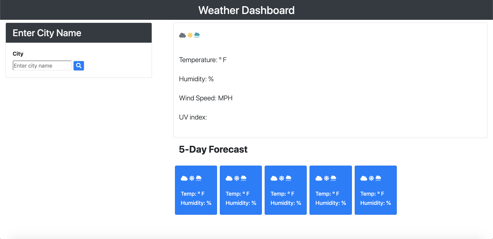

# Project Description
This project builds a website that displayes the current weather and five day forecast for a city. The current day shows the temperature, humidity, UV index, and wind speed. The five day forecast displays the temperature and humidity. The UV index's background color indicates whether the conditions are favorable, moderate, or severe. Both include an icon to describe the day. Every new city that is searched up is logged into a search history on the right hand side that can be clicked to view the weather again. The website uses API calls from OpenWeather to get the weather. The website also uses Moment.js, JQuery, and local storage.

# What the Website Looks Like
This is what the website looks like. The left hand side is where the search history will be displayed. The right hand side will fill in with a place name along with all of the information for the current forecast and five day forecast.

# Link to Deployed Application
Link: https://anishasnet.github.io/weather-dashboard/